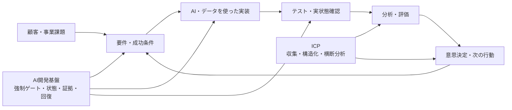
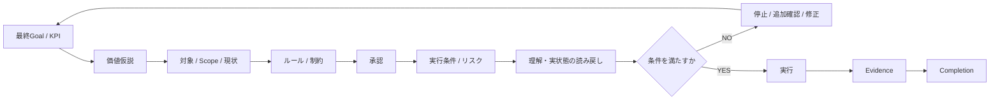
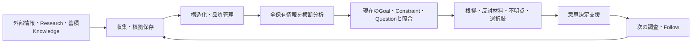

# AI / Data Engineering Portfolio

顧客・事業課題を理解し、**要件化 → AI・データを使った実装 → 検証 → 分析 → 意思決定支援**までつなげることをテーマにした個人開発Portfolioです。

営業、新規事業、プロダクト開発で培った課題理解を起点に、現在はChatGPT / Codex / Claudeを実装手段として使いながら、AI開発基盤、情報収集・分析基盤、デスクトップアプリを設計・開発しています。

主に、FDE、AIソリューション、応用AI、データ分析・意思決定支援に近い役割を志向しています。

## まず見てほしい3つ

### 1. AI開発基盤 — AIが間違っても工程を壊さない

AIによる実装速度が上がるほど、指示の過剰解釈、古い前提、未完了の完了判定、セッション断による状態喪失、別AIへの引き継ぎずれが問題になります。

この問題を「AIの注意力」ではなく**開発工程の制御問題**として捉え、強制ゲート、状態管理、証拠に基づく完了判定、回復、複数AI間の安全な引き継ぎを設計しています。

- [AI開発基盤の詳細](projects/01_ai_development_foundation.md)
- [Python公開コード: AI実装結果の安全な適用](samples/result_apply_guard.py)
- [Pythonテスト](samples/test_result_apply_guard.py)

### 2. Intelligence Collection Platform（ICP）— 情報から意思決定まで

世界中の情報、既存Research、蓄積Knowledgeを継続的に集め、根拠・時間・履歴・不足を保ったまま構造化し、**全保有情報を横断して現在の目的・判断に本当に影響する材料へ変換する**基盤を設計・開発しています。

Signal Harvesterは、その中の収集・Evidence / Provenance・履歴・差分を担う基盤です。ICPではさらに、Coverage、反対材料、不明点、選択肢、再判断条件まで含めて意思決定支援へつなげます。

- [ICPの詳細](projects/02_intelligence_collection_platform.md)
- [Signal Harvesterの技術詳細](projects/02_signal_harvester.md)
- [JavaScript公開コード: 取得証拠の検証と再現](samples/evidence_verification.js)

### 3. FormPilot — 動くアプリとして届ける

Electron / React / SQLite / PostgreSQLを使ったWindows向けデスクトップアプリです。画面だけでなく、永続化、認証、実行キュー、回復、可観測性、Unit Test、E2E、CIまで含めて段階的に開発しています。

- [FormPilotの詳細](projects/04_formpilot.md)
- [TypeScript公開コード: 自動処理の再試行ポリシー](samples/automation_retry_policy.ts)

---

## 私が担っていること / AIへ委譲していること

私は、手書きでコードを書くこと自体を主な役割にはしていません。**ChatGPT / Codex / Claudeへコード生成・修正を委譲し、自分は問題設定から受入までの判断を担う**形で開発しています。

### 私が担う範囲

- 顧客・事業課題の整理
- 最終Goal / KPIの定義
- 要件・仕様・アーキテクチャ方針
- 実装タスクの分解と指示
- Scope・制約・承認条件の定義
- 生成された差分と実装結果のレビュー
- Unit / E2E / 回帰テスト観点の設計
- Git / CI / 実システム状態の読み戻し
- 不具合の原因切り分けと修正方針
- 受入可否と次の改善判断
- データ分析と意思決定への接続

### AIへ委譲する範囲

- コード生成・修正
- 実装案の作成
- 調査の補助
- テストコード作成の補助
- 別視点でのレビュー

AIが「できました」と返したこと自体は完了証拠にせず、**仕様・差分・テスト・CI・保存先の実状態を確認してから受け入れる**ことを重視しています。

---

## 開発の全体像

「何を作るか」「正しく作れたか」「その結果をどう判断に使うか」を別々にせず、一つの流れとして扱うことを目指しています。

## 代表プロジェクトの位置づけ

| プロジェクト | 解いている問題 | 現在の位置づけ | 主に示したい力 |
|---|---|---|---|
| [AI開発基盤](projects/01_ai_development_foundation.md) | AI実装のScope逸脱・誤完了・状態喪失・再試行事故 | 個人開発・検証継続中。Loop RuntimeはLocal PoC | 要件、制御設計、検証、回復、複数AI連携 |
| [ICP](projects/02_intelligence_collection_platform.md) | 情報を集めるだけでなく、根拠を保って判断材料へ変える | 設計・開発中。収集・Corpus基盤を土台に意思決定層を統合中 | データ設計、Coverage、分析、意思決定支援 |
| [FormPilot](projects/04_formpilot.md) | デスクトップアプリを状態・永続化・回復まで含めて届ける | 段階実装・検証中 | アプリ設計、永続化、認証、E2E、CI |

補助的な技術詳細として、[Signal Harvester](projects/02_signal_harvester.md) と [Review / Handoff Platform](projects/03_review_handoff_platform.md) も公開しています。

---

## AI開発基盤で特徴的な「強制ゲート」

単なるチェックリストではなく、**条件を満たさない限り次工程へ進ませない**ことを狙っています。

対象はコード品質だけではありません。最終Goal、Marketing / Brand上の価値仮説、Scope、Rule、Approval、Execution、Readback、Evidence、Completionまでを分けて扱っています。

---

## ICPで重視していること

ICPはニュース一覧やRAGの構築そのものを目的にしていません。

特に以下を重視しています。

- 最新数件だけでなく、取得基準日時までの利用可能な全保有情報を対象にする
- Fact / EvidenceとDecisionを別の責任境界として扱う
- 重複、訂正、独立性、Missing、Coverageを隠さない
- 取得時刻と情報が扱う出来事の時刻を混同しない
- 反対材料・代替説明・不明点を残す
- 「何が分かったか」だけでなく「自分にどう関係するか」「何を選べるか」「何が起きたら考え直すか」まで返す

---

## 公開コードサンプル

主要プロジェクト本体は非公開ですが、設計思想と検証方法を確認できるよう、公開可能な部分を小さなコードサンプルとして切り出しています。

| サンプル | 技術 | 確認できること |
|---|---|---|
| [AI実装結果の安全な適用](samples/result_apply_guard.py) | Python | Git Head照合、変更範囲制限、状態遷移、結果不明時の再実行防止 |
| [取得証拠の検証と再現](samples/evidence_verification.js) | JavaScript | SHA-256、引用位置、保存済みデータからの再検証 |
| [自動処理の再試行ポリシー](samples/automation_retry_policy.ts) | TypeScript | 失敗理由、処理状態、自動再試行 / 手動確認の判定 |

詳細: [公開コードサンプルについて](samples/README.md)

## 検証の例

- AI開発基盤: 対象Revision、許可範囲、状態遷移、結果不明時の再実行防止などをテスト
- Signal Harvester: 履歴・差分・取得証拠・Provenance・保存済みデータからの再検証を実装
- Review / Handoff Platform: 古いGit Head、Scope外変更、不正な状態遷移を拒否する設計・検証
- FormPilot: Typecheck / Lint / Unit Test / Build / 認証付きElectron E2EをCIで確認
- この公開Portfolio自体もGitHub Actionsでコードサンプルを自動テスト

## 扱っている技術

- Python
- TypeScript / JavaScript
- Node.js
- Electron / React
- SQLite / PostgreSQL
- Git / GitHub
- GitHub Actions
- Unit Test / E2E / Regression Test
- ChatGPT / Codex / Claude

※上記は、AI支援型の開発で設計・実装指示・差分確認・検証・受入に使用している技術です。手書きコーディング能力を示す一覧ではありません。

## このPortfolioで示したいこと

AIやデータを導入すること自体ではなく、

**課題を理解する → 要件にする → 実装可能な形へ落とす → 検証する → データから判断する → 次の改善へ戻す**

ところまで一貫して扱えることを示したいと考えています。
