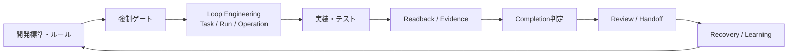
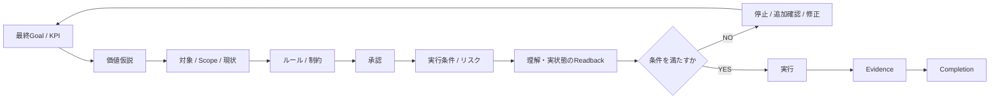

# AI開発基盤 — AIが間違っても工程を壊さないための基盤

## 現在の位置づけ

**個人開発・設計 / 実装 / 検証継続中です。**

共通標準、強制ゲート、状態・承認・証拠の契約、Review / Handoffの仕組みを複数Repositoryで開発しています。Loop Runtimeは現在Local PoCであり、本番Runtimeとしての完成や自律的なDeploy / Mergeを主張していません。

## 何を解こうとしているか

ChatGPT / Codex / Claudeを使うと、コード生成そのものは速くなります。一方、実際の開発では別の問題が繰り返し起きます。

- 依頼を過剰解釈し、Scopeが広がる
- 古い前提や古いRevisionを現在の前提として扱う
- AIが「完了」と答えたが、Git / CI / 実状態では未完了
- Sessionが切れ、次のAIが現在地やOwner判断を失う
- 別AIへ渡した結果が、別のHead / Branch / Taskへ誤適用される
- 外部書き込みの結果が不明なのに、同じ操作を再実行してしまう
- 一度起きた失敗が、別Sessionで繰り返される

最初はPromptやChecklistを改善していましたが、繰り返すほど、これは**AIの注意力の問題ではなく開発工程の制御問題**だと考えるようになりました。

そこで、AI自身に「気をつけてもらう」のではなく、AIの外側にGate・State・Evidence・Readbackを置く方向へ設計しています。

## 全体像



一般的なGit / Test / CIに加えて、**AI開発特有のScope逸脱、誤完了、状態喪失、複数AI連携、再試行事故**を制御対象にしています。

## 中核1: 強制ゲート

単に「このルールを守ってください」とPromptに書くのではなく、**条件を満たさない限り次工程へ進ませない**設計を重視しています。



Gateはコード品質だけを確認するものではありません。

- 最終Goal / KPI
- Marketing / Brand上の価値仮説
- 対象Repository / Branch / Head / Scope
- Security / Data / 外部操作等の制約
- Owner Approvalとその対象
- 実行直前の条件・Risk
- AIが理解した内容と実状態のReadback
- 実行後のEvidence
- Completion条件

までを分けて扱います。

## 中核2: AIの自己申告を完了証拠にしない

AIが「完了しました」と答えても、その発言だけでは完了扱いしません。

確認対象の例:

- Current Git Head
- 実際の差分
- Test結果
- CI結果
- 保存先のCurrent State
- Approvalと対象Revisionの一致
- 必須Artifactの存在
- 外部操作後のReadback

状態も、単純な「できた / できていない」ではなく、保存・適用・設定・強制・検証を分けて扱います。

```text
PROPOSED
→ APPLIED
→ PERSISTED
→ CONFIGURED
→ ENFORCED
→ VERIFIED
```

## 中核3: 結果不明を成功・失敗へ丸めない

外部Writeの応答が失われた場合などは、成功とも失敗とも断定しません。

`OUTCOME_UNKNOWN`として保持し、**実状態をReadbackしてから**次を判断します。

これにより、結果不明のまま同じWriteを再実行して二重変更する事故を防ぐ設計にしています。

## 中核4: Sessionをまたいで現在地を復元する

Conversation historyを開発状態の正本にはしません。

長期タスクでは、以下のような情報を会話の外へ保存し、新しいSession / Agentでも復元できる形を目指しています。

- 最終Goalと成功条件
- 現在Phase
- Active Task
- Owner Decision
- Next Action
- Approval / Evidence参照
- Blocker / 未検証事項
- Repository / Branch / Head

## 中核5: 複数AI間の安全なReview / Handoff

別AIへ渡すときは、文章をコピーするだけでは結果のAuthorityが曖昧になります。

そこで、Task / Repository / Branch / Head / Request / Resultを紐付け、古いRevisionや別TaskのResultを現在のResultとして扱わないことを重視しています。

詳細: [Review / Handoff Platform](03_review_handoff_platform.md)

## 中核6: 失敗を基盤へ戻す

その場の修正で終わらせず、再発可能な失敗は、

```text
Incident
→ 原因整理
→ 一般化
→ 適切なGate / Rule / Validator / Testへ反映
→ 別文脈で再検証
```

という形で共通基盤へ戻すことを狙っています。

「今回直った」と「再発しにくい仕組みにした」を分けて扱います。

## Loop Runtimeで検証していること

現在のLoop RuntimeはLocal PoCです。主に次のような仕組みを検証しています。

- SQLiteによるTask / Run / Operation / Event / Leaseの永続化
- Repository / Branch / Full HeadへのBinding
- Approvalを対象OperationへBinding
- 排他的Leaseと重複Wakeup処理
- `SAFE_TO_RETRY` と `EFFECT_MAY_HAVE_OCCURRED` の分離
- `OUTCOME_UNKNOWN`のReadback / Reconciliation
- Checkpoint / Restore / Corruption時のFail Closed
- Completion前のCurrent Head再確認
- 直接的な `RUNNING -> SUCCEEDED` を禁止し、Completion Gateを通す
- Scheduler / UIをAuthorityにしない分離

本番運用済みRuntimeとしてではなく、**Authority / State / Evidenceをどこへ置けばAI開発を安全に制御できるかを検証するPoC**として扱っています。

## 公開コードで確認できること

- [Python: AI実装結果の安全な適用](../samples/result_apply_guard.py)
- [Python: テスト](../samples/test_result_apply_guard.py)

公開用サンプルでは、実プロジェクトから依存関係を減らし、次の考え方を確認できる形にしています。

- Git Headが一致しなければ停止
- 許可範囲外の変更を拒否
- 不正な状態遷移を拒否
- 結果不明のまま再実行しない
- 実状態確認後にのみ最終状態を確定

## 私が担っていること

- 問題定義
- 最終Goal / KPI・成功条件の整理
- Requirement / Architecture / State / Authority設計
- Gate・Approval・Evidence境界の設計
- Codex / Claudeへの実装指示とTask分解
- 生成された差分・Test・CIの確認
- Git / Current StateのReadback
- 不具合原因の切り分け
- 修正方針・受入可否の判断
- Incidentを共通Rule / Gateへ戻す判断

コード生成・修正そのものはAIへ委譲しています。

## このプロジェクトで示したいこと

AI開発の価値はモデル性能だけでは決まらず、**目的、Scope、Authority、State、Evidence、Recovery、Completionを外部システムとして設計できるか**でも大きく変わると考えています。

この基盤は「AIを賢くする基盤」というより、**AIが間違っても開発工程を壊しにくくする基盤**です。
