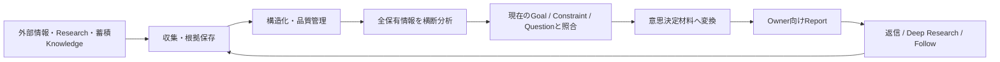
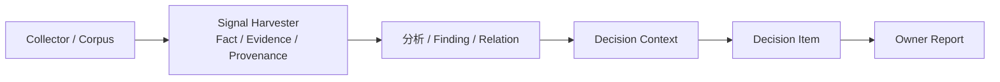

# Intelligence Collection Platform（ICP）— 情報収集から意思決定支援まで

## 現在の位置づけ

**個人開発・設計中です。**

収集・履歴・Evidence / Provenance・Corpus保存などの土台には実装済み部分があります。一方、全保有情報の横断分析からDecision Supportまでを一つのProductとして統合する部分は現在設計・開発中であり、完成済みProductや本番稼働済み意思決定システムとしては扱っていません。

## 何を解こうとしているか

情報を集めるだけならCrawlerやRSS Readerでもできます。

ただし、実際の意思決定に使おうとすると、次の問題が残ります。

- 同じ情報の転載・再取得で「件数」だけが増える
- 取得時点と出来事の時点が混ざる
- Sourceが更新され、当時何を根拠にしたか再現できない
- Coverageが足りないのに「情報がなかった」と誤認する
- 新しい / 人気 / 高確信というだけで重要情報として扱ってしまう
- 支持材料だけを集め、反対材料やUnknownを落とす
- 分析結果が、現在のGoalやDecisionとつながらない
- 「面白いFinding一覧」で終わり、次の行動を選べない

ICPでは、**取得基準日時までに利用可能な保有情報全体を横断し、現在の目的・判断に本当に影響する材料だけを、根拠・不足・反対材料と一緒に返す**ことを目指しています。

## 全体像

### 1. 外部情報・Research・蓄積Knowledge

対象は最新ニュースだけではありません。

- Web / RSS / GitHub等の外部情報
- 過去に取得した情報
- Historical data
- 既存Research
- 保存済みKnowledge

を、利用可能な範囲で一つの分析Universeとして扱うことを目指しています。

### 2. 収集・根拠保存

後段のAIが文章を作る前に、まず「何を見たか」を再検証できる状態にします。

- Source identity
- 取得方法
- 取得時刻
- 本文Hash
- Evidence位置
- Provenance
- 取得Run
- 保存済みRaw / normalized record

Signal Harvesterはこの領域のFact / Evidence / Provenance基盤を担います。

詳細: [Signal Harvester](02_signal_harvester.md)

### 3. 構造化・品質管理

単純な類似度だけで同じ情報として潰さず、次のような状態を保持します。

- 重複 / 派生 / 独立性
- Correction / Supersession
- Missing / Unknown
- 取得失敗
- Coverage
- Current Knowledgeと過去Revision
- Evidence lineage

「取れなかった」と「何も起きなかった」を区別することを重視しています。

### 4. 全保有情報を横断分析

最新Windowだけを見るのではなく、Whole Holdingsの分析ではcutoffまでに利用可能な保有情報全体を対象にします。

見るものの例:

- Pattern
- Delta
- Relation
- Independent convergence
- Counterevidence
- Alternative explanation
- Missingness
- Historical analogue
- Reopen condition

分析に使ったUniverseと、新規・更新分のWindowを混同しない設計にしています。

### 5. 現在の目的・判断と照合

Findingが「新しい」「珍しい」「高確信」だけではMain Reportへ入れません。

現在のGoal / Constraint / Questionに対して、次のどれかを変えられるかを見ます。

- 選択肢の実行可能性
- Recommendation
- Blocker / Unknown
- Urgency
- Reopen condition
- 次に確認すべきEvidence

判断に影響しないFindingはKnowledgeとして保持しても、Main Decision Reportの主役にはしません。

### 6. 意思決定材料へ変換

同じDecisionに関係する複数Findingを一つのDecision単位へ束ねます。

含める内容の例:

- 支持Evidence
- Materialな反対材料
- Alternative explanation
- Unknown
- feasible option
- Trade-off
- 現在のRecommendation / Hold
- 何が変われば結論を変えるか

数値Scoreを無理に捏造するのではなく、Benefit / Downside / Deferral / Cost / Reversibilityなど、Materialな比較軸だけを使う方針です。

### 7. Owner向けReport

最終OutputはAnalytics Dashboardやニュース一覧ではなく、普通の日本語で次を答えることを目指しています。

1. 何が分かった？
2. 自分にどう関係する？
3. 何を選べる？
4. 今どうする？
5. 何が起きたら考え直す？

## Trust Header / Coverage

結論より前に、**何を・いつからいつまで・どれだけ見た結果なのか**を確認できることを重要要件にしています。

最低限、次を区別します。

- 分析時点 / information cutoff
- 今回の分析Window
- ICPが実際に取得・利用可能になった期間
- 情報そのものが扱う出来事 / 公開期間
- latest raw collection
- latest analytics
- unanalysed interval
- 全保有Run数 / Item数 / 使用件数 / 除外 / 未解決
- Collector / Input Class別Coverage
- Missing / unavailable / unknown

正確な件数や期間を復元できない場合は、推測で埋めずにUnknownとして表示する設計です。

## FactとDecisionを分ける

ICPのDecision layerは、収集したFact / Evidenceの真実を書き換えるAuthorityを持ちません。

- Corpusに存在するだけでCanonical Factにはしない
- Signal Harvester側のPromotion / Validationを通してFact Authorityへ昇格
- Decision層はEvidenceを参照するが、Factの履歴やProvenanceを上書きしない

という境界を重視しています。

## 反対材料・Unknownを残す

High-convictionな結論を出すこと自体を目的にはしていません。

必要なEvidenceが足りない場合は、

- `追加Evidenceが必要`
- `監視`
- `Context不足`
- `Coverage不足`

のように、**判断しない状態を正しく出す**ことも重要だと考えています。

## Feedback / Learning

Reportへの自然言語返信から、

- 詳しく調べる
- Followする
- 「違くない？」を受けて再検証する
- 次回の探索条件を改善する

ことを想定しています。

ただし、Ownerの好みやAIの自己強化でFact認識を歪めないよう、Feedback / LearningとFact Authorityは分けます。

## 現在ある実装基盤

### Signal Harvester

- GitHub / Hacker News / RSS / Web等の取得
- 正規化
- 履歴・差分
- Source / acquisition methodの分離
- Evidence / Provenance
- SHA-256による本文固定
- 保存済みデータからの再検証

### ICP Corpus

Private cold corpusとして、Collector Run、operational state、Digest artifact、Signal Harvesterへのpromotion candidate等を保存しています。

Corpus recordは存在するだけではCanonical Factではなく、Signal Harvester側の明示的なimport / promotionを経てFact Authorityへ入る境界にしています。

## 公開コードで確認できること

- [JavaScript: 取得証拠の検証と再現](../samples/evidence_verification.js)
- [JavaScript: テスト](../samples/evidence_verification.test.js)

公開サンプルでは、次を確認できます。

- SHA-256による本文改変検知
- 引用位置と保存本文の一致確認
- 保存済みArtifact欠落時の明示的な未検証扱い
- Live Webへ再アクセスしない再検証

## 私が担っていること

- Product Goal / Requirement設計
- 分析Universe / Window / Coverage要件
- Fact / Evidence / DecisionのAuthority境界
- Data / identifier / time / provenance設計
- Decision SupportのOutput設計
- Counterevidence / Unknown / Abstain条件
- AIへの実装Task分解・指示
- 生成された差分・Test・CIの確認
- 仕様と実装の不一致修正方針
- Reportを実際の意思決定へつなげる設計

コード生成・修正そのものはChatGPT / Codex / Claudeへ委譲しています。

## このプロジェクトで示したいこと

単なるCrawlerやRAGではなく、

**収集 → Evidence / Provenance → 構造化 → Coverage → 横断分析 → Decision Context → 選択肢 / Trade-off → 意思決定支援**

までを一つのData / Intelligence lifecycleとして設計することを目指しています。
