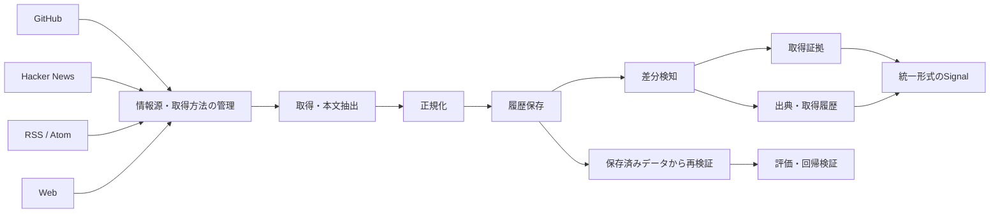

# Signal Harvester — ICPのFact / Evidence基盤

## ICPとの関係

Signal Harvesterは、[Intelligence Collection Platform（ICP）](02_intelligence_collection_platform.md)のうち、**Observation / Evidence / Provenance / Signal identityを安全に扱うFact基盤**です。

ICPのCorpusや分析層にデータが存在するだけではCanonical Factとして扱わず、Signal Harvester側の検証・Promotion境界を通して、根拠・履歴・時間・訂正関係を保ったまま扱う設計にしています。

このページでは、ICP全体ではなく**収集・再現・根拠管理の技術詳細**に絞って説明します。

## 概要

GitHub / Hacker News / RSS / Webなど複数の情報源から情報を取得し、**履歴・差分・取得証拠・出典情報を保持しながら再現可能に扱う情報収集基盤**です。

**情報源 → 取得 → 正規化 → 履歴保存 → 差分検知 → 取得証拠・出典管理 → 統一形式のSignal → 再検証**

という流れを重視しています。

## 全体像

単なる収集ではなく、**後から「何を・いつ・どの情報源・取得方法から得たか」を再構成できること**を重視しています。

## 解きたかった問題

ニュースやWeb情報を集めるだけならCrawlerで足りますが、後段でAI分析や意思決定に使うには次の問題が残ります。

- 同じ情報が転載・再取得され、件数だけ増える
- 本文が更新されると、当時何を読んだか再現できない
- AIが引用した根拠が元本文のどこにあったか追えない
- 取得方法が変わると、情報源そのものと取得手段を混同しやすい
- 評価時にネットワークへ再アクセスすると、当時と違うデータを使ってしまう

そこで、**取得した内容・識別子・時刻・出典・取得方法・本文Hashを分けて保存し、後から再検証できる構造**を重視しています。

## 代表的な設計判断

### 1. 本文をHashで固定する

抽出本文のSHA-256を保持し、保存後に本文が変わっていないか再検証できるようにしています。

### 2. 引用位置を本文に紐付ける

AIや後段処理が使った根拠を、単なる文字列として保存するだけでなく、抽出本文内の位置と結びつけます。本文Hashと組み合わせることで、引用が本当にその取得結果に存在したか確認できます。

### 3. 情報源と取得方法を分ける

「どの媒体・ページの情報か」と「HTTP / RSS / 別Providerなど、どう取得したか」を分離して管理します。

### 4. 再検証時はネットワークへ取りに行かない

保存済みデータを使った再検証では、Live Webへ再アクセスしないことを明示しています。これにより、過去時点の評価で未来の更新内容が混ざることを防ぎます。

## 主な実装

- GitHub / Hacker Newsの観測
- RSS 2.0 / Atom 1.0
- 条件付きWeb取得
- 情報源の登録・管理
- 情報源と取得手段の分離
- 正規化データの保存
- 実行履歴
- 差分優先の比較
- 改変されない取得証拠
- 出典・取得履歴の保存
- Signal識別子のVersion管理
- ネットワークへ再アクセスしない再検証
- fixture / mockを使った回帰テスト

## 公開コードで確認できること

- [JavaScript: 取得証拠の検証と再現](../samples/evidence_verification.js)
- [JavaScript: テスト](../samples/evidence_verification.test.js)

公開版では実装の本質部分を小さく切り出し、次を確認できるようにしています。

- SHA-256による本文改変検知
- 引用位置と本文の一致確認
- 保存済み取得物が欠落している場合の明示的な未検証扱い
- ネットワークへ再アクセスしない再検証
- テストで正常系・改変・欠落を確認

## 私が担っていること

- 製品要件・仕様設計
- データ形式・識別子・出典管理方針の設計
- 実装Taskの分解とAIへの指示
- 生成された差分の確認
- テスト・回帰・再検証観点の設計
- CI・保存結果・動作の確認
- 仕様と実装の不一致に対する修正方針
- ICPの分析・意思決定層とのAuthority境界設計

コード生成・修正そのものはChatGPT / Codex / Claudeへ委譲しています。

## このプロジェクトで示したいこと

単純なCrawlerではなく、**データ処理基盤・統一形式化・時間情報・出典管理・評価可能なEvidence**まで意識して設計し、その上にICPの分析・意思決定支援を積み上げています。
