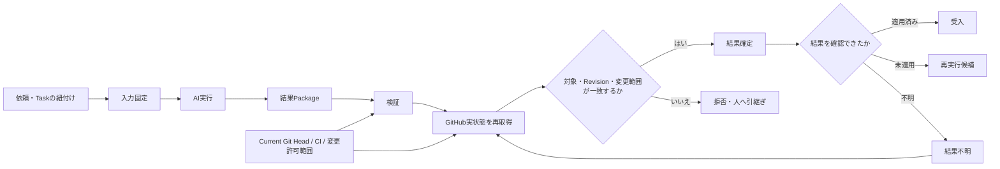

# Review / Handoff Platform

## 現在の位置づけ

**AI開発基盤を構成する補助プロジェクトです。**

AIが実装やレビューを担当する際に、**「どのタスクに対する、どの入力から、どの結果が返ってきたか」**を安全に追跡し、古い結果や別Taskの結果を誤適用しないことを目的にしています。

AI開発基盤全体については [AI開発基盤の詳細](01_ai_development_foundation.md) を参照してください。

## 概要

**依頼 → 入力固定 → AI実行 → 結果パッケージ → 検証 → GitHub実状態確認 → 結果確定 → 適用・拒否・人への引継ぎ**

という流れで、AIの自己申告だけで完了扱いしない設計にしています。

## 全体像

AIの出力そのものではなく、**GitHub上の実状態・対象Revision・CI・許可された変更範囲まで照合して結果を確定する**ことを重視しています。

## 主な実装テーマ

- RepositoryとTaskの紐付け
- 入力・結果の決定的な識別
- GitHub上の実状態再取得
- 古い結果・不一致結果の検知
- AI結果を適用するための契約
- Current Git Head確認
- 変更可能ファイルの許可リスト
- 結果不明状態
- 状態確認なしの再実行防止
- 不明な場合は止める結果確定
- Ubuntu / WindowsでのCI検証

## 実装・検証の例

- Ubuntu CI: PASS
- Windows CI: PASS
- 全Unit Test: PASS
- Python compile check: PASS
- 古いGit Head・変更許可範囲外・不正な状態遷移を拒否
- 結果が不明な場合、GitHubの実状態を確認するまで再実行しない

## 公開コード

[AI実装結果の安全な適用サンプル](../samples/result_apply_guard.py)

実プロジェクトの結果適用ロジックから、対象Head確認・変更範囲制限・状態遷移・結果不明時の再実行防止を抜き出しています。

## 私が担っていること

- 実運用で発生したAI引継ぎ上の問題定義
- Result / Authority / State transitionの設計
- 実装Taskの分解とCodex / Claudeへの指示
- 生成された差分の確認
- 異常系Test観点の設計
- Review指摘の分析
- 安全に止まらない箇所の修正方針決定
- GitHub / CIの実状態確認による受入判断

コード生成・修正そのものはAIへ委譲しています。

## このプロジェクトで示したいこと

AIエージェントをSoftware Deliveryへ組み込む際には、**モデルが「成功」と答えたかではなく、外部システムの実状態を確認して結果を確定する**ことが重要だと考えています。
