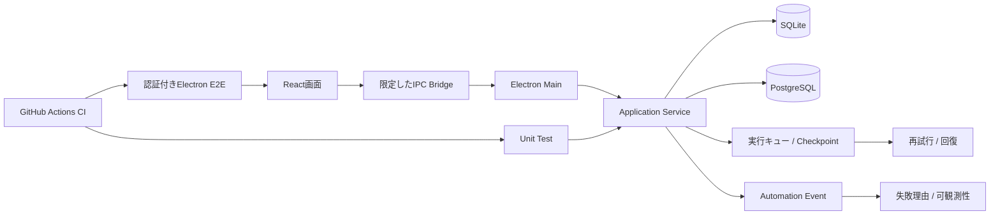

# FormPilot — Windowsデスクトップアプリ

## 現在の位置づけ

**個人開発・段階実装 / 検証中です。**

Electron / React / SQLite / PostgreSQLを使い、画面だけでなく、永続化、認証、実行キュー、回復、可観測性、Unit Test、E2E、CIまで含めてSoftware Deliveryを検証しています。

## 何を示したいプロジェクトか

AI開発基盤やICPは設計思想が強いプロジェクトなので、FormPilotでは、**実際に動くアプリケーションを、状態・永続化・回復・テストまで含めて段階的に作る**ことを重視しています。

## 全体像

## 技術

- TypeScript
- Electron
- React
- SQLite
- PostgreSQL
- pnpm
- GitHub Actions

※コード生成・修正はAIへ委譲し、私は要件・設計・実装指示・差分確認・検証・受入を担当しています。

## 実装済みの主な領域

- Electron sandbox / 限定したIPC bridge
- SQLite migration
- campaign / targetの永続化
- crash-safeな実行キュー・回復基盤
- workspace認証・権限境界
- sender profile / template version
- campaign settings
- pacing / test mode
- 自動処理イベント
- 失敗理由コード
- 再試行安全性の判定
- 認証付きElectron E2E

## 検証

Phase 4ではGitHub Actions上で以下を確認しています。

- Governance: PASS
- Typecheck: PASS
- Lint: PASS
- Unit tests: PASS
- Build: PASS
- 認証付きElectron E2E: PASS

Phase 5Aでは以下を追加しています。

- SQLiteへの自動処理イベント保存
- 決定的な並び順
- 複数試行の履歴
- 失敗理由の分類
- 終端イベントと関連状態のatomicな保存
- 関連check PASS

## 公開コード

[自動処理の再試行ポリシー](../samples/automation_retry_policy.ts)

実プロジェクトで使っているCheckpoint・失敗理由・自動再試行可否の考え方を、依存関係を減らして公開しています。

## 私が担っていること

- 製品要件・Phase設計
- 画面・状態・永続化要件の整理
- 実装Taskの分解とChatGPT / Codex / Claudeへの指示
- 生成された差分の確認
- migration / authorization / recovery観点の確認
- Unit / E2E / CIの受入
- 回帰Riskの確認
- Phase単位でのScope control
- 実装結果と設計意図の不一致に対する修正方針

## このプロジェクトで示したいこと

Web APIや設計資料だけでなく、**デスクトップアプリ・Local保存・認証・状態管理・回復・E2Eまで含む実装を、AI支援型の開発プロセスで受け入れ可能な状態まで持っていく**ことを示すためのプロジェクトです。
